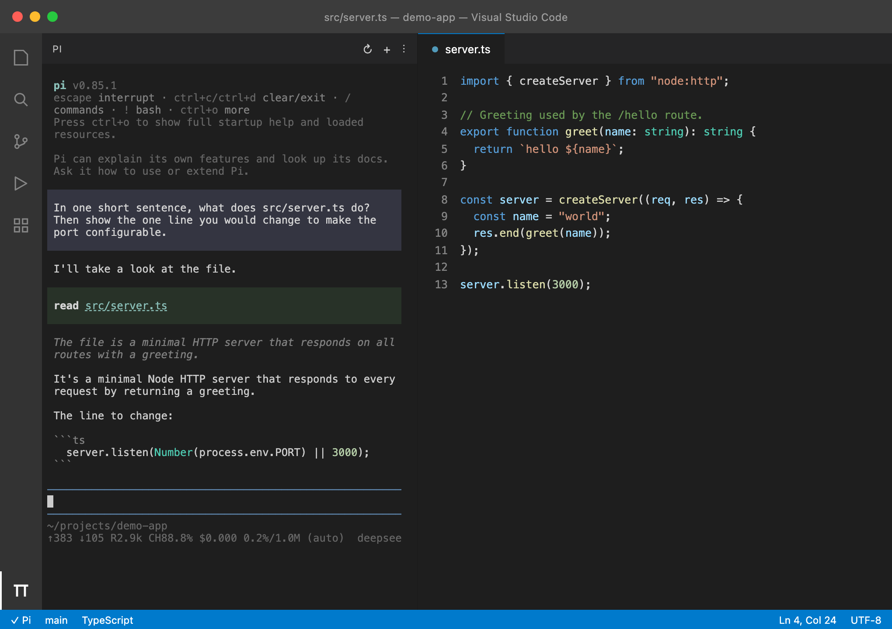

<div align="center">

# Pi for VS Code

**The Pi coding agent, living in your VS Code sidebar.**

A real TUI — not a chat panel reimplementation. Your terminal workflow, one click away from your code.

[](https://github.com/yicLionel/pi-for-vscode/actions/workflows/ci.yml)
[](https://github.com/yicLionel/pi-for-vscode/releases/latest)
[](LICENSE)
[](https://code.visualstudio.com)
[](#requirements)
[](https://github.com/yicLionel/pi-for-vscode/pulls)

<br />



<sub>A real Pi session in the sidebar — the prompt, the tool call, the reasoning and the answer are all genuine Pi TUI output.</sub>

<br />

**[English](#pi-for-vscode) · [简体中文](#简体中文)**

</div>

---

## Why

[Pi](https://pi.dev) is a minimal terminal coding harness. It lives in a terminal, which means it is always one `⌘Tab` away from the code it is editing.

This extension puts the **actual Pi TUI** in the VS Code sidebar using [xterm.js](https://xtermjs.org) over a real pseudo-terminal. Nothing is re-implemented and nothing is simulated: slash commands, keybindings, themes, `/login`, session resume, mouse reporting, bracketed paste, tool approval prompts and full-screen TUIs all behave exactly as they do in your terminal — because it *is* your terminal.

## Features

- **Real TUI in the sidebar** — a dedicated Activity Bar container. Click the π icon, or run `Pi: Focus Pi Sidebar`.
- **A real PTY** — ANSI colours, true colour, resizing, mouse reporting and bracketed paste all work. Pi's own keybindings reach Pi.
- **Multiple sessions** — `Pi: New Pi Terminal (Editor Tab)` opens an independent session next to your code.
- **Auto-detects `pi`** — searches `PATH`, Homebrew, npm/pnpm global, Volta, asdf, nvm, `~/.local/share/pi-node`, then falls back to your login shell's `PATH`.
- **Launches `#!/usr/bin/env node` scripts correctly** — Pi is a Node script, and GUI-launched VS Code often has no `node` on `PATH`. The extension resolves a matching interpreter (the `pi-node` distribution ships its own) so it starts anyway.
- **Theme and font aware** — follows your terminal colours, editor font and cursor style, and updates live when you switch themes.
- **Send code to Pi** — right-click a selection → *Send Selection to Pi*, or press <kbd>⌘⌥P</kbd> / <kbd>Ctrl+Alt+P</kbd>. *Send Current File Reference* drops an `@path` into the prompt.
- **Clickable paths** — `src/app.ts:42:7` in Pi's output becomes a link. <kbd>⌘</kbd>/<kbd>Ctrl</kbd>-click to open it at that exact line.
- **Clipboard that always works** — copy and paste go through the VS Code clipboard API instead of the webview, so they work in remote, WSL and web contexts too.
- **Zero native compilation** — the PTY layer ships N-API prebuilt binaries for macOS, Linux and Windows. No Xcode Command Line Tools, no Visual Studio Build Tools.
- **Status bar and error overlay** — Pi's state at a glance, and an actionable overlay (retry, pick binary, open settings, show logs) when startup fails.

## Requirements

| | |
|---|---|
| VS Code | 1.85 or newer |
| Pi | `npm install -g --ignore-scripts @earendil-works/pi-coding-agent` |

If `pi` is somewhere unusual, point the extension at it:

```jsonc
{ "pi-for-vscode.executablePath": "/opt/pi/bin/pi" }
```

## Install

Pi for VS Code is distributed through **GitHub Releases** — there is no Marketplace listing.

**1. Download the VSIX** from the [latest release](https://github.com/yicLionel/pi-for-vscode/releases/latest)
(`pi-for-vscode-<version>.vsix`). Optionally check it against `SHA256SUMS.txt` from the same release:

```bash
shasum -a 256 -c SHA256SUMS.txt
```

**2. Install it**

```bash
code --install-extension pi-for-vscode-0.1.0.vsix
```

Then reload the window (<kbd>⌘⇧P</kbd> → *Developer: Reload Window*).

**Or build from source**

```bash
git clone https://github.com/yicLionel/pi-for-vscode.git
cd pi-for-vscode
npm install
npm run compile
# press F5 in VS Code, or:
npm run package && code --install-extension pi-for-vscode-0.1.0.vsix
```

## Quick start

1. Click the **π** icon in the Activity Bar.
2. Pi starts in your workspace root.
3. Run `/login` the first time, then just talk to it.

Prefer a different model or a per-project key?

```jsonc
{
  "pi-for-vscode.args": ["--model", "anthropic/claude-sonnet-4"],
  "pi-for-vscode.env": { "ANTHROPIC_API_KEY": "sk-..." }
}
```

## Commands

| Command | Description |
| --- | --- |
| `Pi: Focus Pi Sidebar` | Reveal and focus the sidebar TUI |
| `Pi: New Pi Terminal (Editor Tab)` | Open another Pi session in an editor tab |
| `Pi: Restart Pi` | Restart the active session |
| `Pi: Kill Pi` | Stop the active session |
| `Pi: Clear Pi Terminal` | Send <kbd>Ctrl+L</kbd> to Pi |
| `Pi: Send Selection to Pi` | Insert the selection into the prompt |
| `Pi: Send Selection to Pi and Submit` | Insert and press Enter |
| `Pi: Send Current File Reference to Pi` | Insert `@relative/path` |
| `Pi: Set Pi Executable Path…` | Pick the `pi` binary |
| `Pi: Open Pi Settings` | Open this extension's settings |
| `Pi: Show Pi Logs` | Open the output channel (resolved binary, interpreter, cwd, pid) |

## Settings

| Setting | Default | Description |
| --- | --- | --- |
| `pi-for-vscode.executablePath` | `""` | Explicit path to `pi`. Empty means auto-detect. |
| `pi-for-vscode.args` | `[]` | Extra arguments on every start, e.g. `["--continue"]`. |
| `pi-for-vscode.autoStart` | `true` | Start Pi when the sidebar opens. |
| `pi-for-vscode.cwd` | `"workspace"` | `workspace` \| `file` \| `home` \| `custom` |
| `pi-for-vscode.customCwd` | `""` | Used when `cwd` is `custom`. |
| `pi-for-vscode.env` | `{}` | Extra environment variables (API keys, etc.). |
| `pi-for-vscode.fontFamily` | `""` | Empty follows the editor font. |
| `pi-for-vscode.fontSize` | `0` | `0` follows the editor font size. |
| `pi-for-vscode.lineHeight` | `0` | `0` lets xterm.js choose. |
| `pi-for-vscode.cursorBlink` | `true` | Blink the cursor. |
| `pi-for-vscode.scrollback` | `10000` | Scrollback lines kept in the webview. |
| `pi-for-vscode.sendSubmit` | `false` | Auto-press Enter when sending a selection. |
| `pi-for-vscode.fileLinks` | `true` | Make `path:line:col` clickable. |

## Keyboard shortcuts

| Shortcut | Action |
| --- | --- |
| <kbd>⌘C</kbd> / <kbd>Ctrl+C</kbd> | Copy when text is selected, otherwise send `SIGINT` |
| <kbd>⌘V</kbd> / <kbd>Ctrl+V</kbd> / <kbd>Ctrl+Shift+V</kbd> / <kbd>Shift+Ins</kbd> | Paste |
| <kbd>⌘</kbd>/<kbd>Ctrl</kbd>-click | Open a URL or a `path:line:col` |
| <kbd>⌘P</kbd>, <kbd>⌘⇧P</kbd>, <kbd>Ctrl+Shift+P</kbd>, <kbd>F1</kbd> | Handled by VS Code, not Pi |
| Right click | Copy · Paste · Select All · Clear · Restart · Kill |

## How it works

```
Activity Bar
    │
    ▼
WebviewView (xterm.js)  ◀── postMessage ──▶  PiController
                                                  │        state machine,
                                                  │        config, errors
                                                  ▼
                                            PiSession (node-pty)
                                                  │
                                                  ▼
                                        node ─▶ pi … (real TUI)
```

Three problems were worth solving properly:

**1. A PTY inside Electron.** VS Code's extension host runs on Electron, and native modules must match its ABI — the stable VS Code API has no sidebar location for `createTerminal`, so a webview plus a real PTY is the only honest way to get a TUI there. The PTY layer uses N-API prebuilt binaries, which are ABI-independent: the same `pty.node` loads under both system Node and the extension host's Electron. That removes the usual "rebuild for Electron" step entirely.

**2. Launching Pi is not `spawn("pi")`.** Pi is a `#!/usr/bin/env node` script. GUI-launched VS Code frequently has no `node` on `PATH`, so the extension reads the shebang, resolves an interpreter (preferring the `node` bundled next to `pi`, then `PATH`, well-known locations, and finally the login shell's `PATH`), and spawns `node <pi>`. Windows `.cmd`/`.bat` shims are wrapped in `cmd.exe /c`.

**3. Environment isolation.** If VS Code was itself launched from a Pi session, the extension host inherits `PI_SESSION_ID`, `PI_SESSION_FILE` and friends. Passing those to the child `pi` would corrupt its session handling, so they are stripped before spawning.

Smaller details that matter: the webview clipboard goes through `vscode.env.clipboard`; terminal colours come from `--vscode-terminal-ansi*` CSS variables and are re-read on theme changes; and OS-level shortcuts are handed back to VS Code so <kbd>⌘P</kbd> and <kbd>F1</kbd> keep working.

## Troubleshooting

**"Pi could not start"** — click *Show logs*. The output channel records the resolved executable, interpreter, working directory and pid. `Pi: Set Pi Executable Path…` fixes most cases.

**Works locally but not in a container / remote / WSL** — set `pi-for-vscode.executablePath` explicitly. Auto-detection cannot see host paths from inside a container.

**Terminal looks cramped** — widen the sidebar. xterm refits automatically; Pi receives the new size.

**A shortcut does nothing** — check the table above. Keys that VS Code owns (like <kbd>⌘⇧P</kbd>) never reach Pi.

## Development

```bash
npm install
npm run compile          # build extension + webview bundle + icon
npm run watch            # rebuild on change
npm run typecheck        # tsc --noEmit
npm run verify           # the whole suite, no VS Code window needed

npm run smoke            # PTY, pi discovery, headless activation
npm run smoke:webview    # renders the real webview bundle in headless Chrome
npm run smoke:electron   # re-runs activation inside VS Code's Electron runtime
npm run package          # produce pi-for-vscode-<version>.vsix
npm run verify:vsix      # extract the .vsix and test the packaged artifact
npm run docs:screenshot  # regenerate docs/screenshot.png
```

`npm run verify` needs no GUI. It builds the extension, spawns the real `pi`
binary in a PTY, activates the bundled extension against a stubbed `vscode`
module, and renders the webview bundle in headless Chrome. Tests that need `pi`
or a POSIX shell skip rather than fail, so the suite runs unchanged on CI.

### Cutting a release

Bump `version` in `package.json`, then push a matching tag — the
[release workflow](.github/workflows/release.yml) runs the whole suite, packages
the VSIX and attaches it (plus `SHA256SUMS.txt`) to a GitHub Release:

```bash
git tag v0.1.1 && git push --tags
```

The workflow refuses to release if the tag and `package.json` version disagree.

| Suite | Covers |
| --- | --- |
| `scripts/smoke.mjs` | TTY-ness, ANSI passthrough, PTY resize (`stty size`), real `pi --version` through the resolved interpreter |
| `scripts/activation-check.cjs` | `activate()` → sidebar provider → CSP HTML → spawn → stream → restart → kill, plus the no-`pi` error path |
| `scripts/webview-check.mjs` | ready/resize handshake, TUI rendering, state overlays, context menu, zero uncaught errors |
| `scripts/verify-vsix.mjs` | the packaged `.vsix`, extracted and tested in both Node and Electron |

### Project layout

```
src/
  extension.ts        activation, commands, status bar
  sidebarProvider.ts  WebviewViewProvider for the sidebar
  panel.ts            Pi in an editor tab
  piController.ts     state machine + webview protocol
  piSession.ts        node-pty wrapper (vscode-free)
  piLocator.ts        finds pi + resolves the node/bun interpreter (vscode-free)
  config.ts           settings and cwd resolution
  webviewHtml.ts      CSP + HTML shell
  webview/main.ts     xterm.js frontend
scripts/              build, tests and docs tooling
docs/                 screenshots
```

## Contributing

Issues and pull requests are welcome. `npm run verify` must pass; if you touch the
webview, please also run `npm run smoke:webview`. Adding a test that fails before
your fix is the fastest way to get a change merged.

## Credits

Built on [Pi](https://pi.dev), [xterm.js](https://xtermjs.org) and
[node-pty](https://github.com/microsoft/node-pty) (via the
[`@homebridge/node-pty-prebuilt-multiarch`](https://github.com/homebridge/node-pty-prebuilt-multiarch) fork).

## License

[MIT](LICENSE)

---

<div align="center">

## 简体中文

</div>

## 简介

[Pi](https://pi.dev) 是一个极简的终端编码 agent。它活在终端里，所以它离你正在改的代码总是隔着一个 `⌘Tab`。

这个扩展把**真正的 Pi TUI** 放进 VS Code 侧边栏：用 [xterm.js](https://xtermjs.org) 渲染，背后接一个真实的伪终端（PTY）。没有任何东西是重写或模拟的 —— 斜杠命令、快捷键、主题、`/login`、会话续接、鼠标上报、括号粘贴、工具授权提示、全屏 TUI，全都和你终端里一模一样，因为**它就是你的终端**。

## 特性

- **侧边栏里的真 TUI** —— 独立的 Activity Bar 容器，点 π 图标或执行 `Pi: Focus Pi Sidebar`。
- **真 PTY** —— ANSI 色彩、truecolor、resize、鼠标上报、括号粘贴全部可用；Pi 自己的快捷键能直达 Pi。
- **多会话** —— `Pi: New Pi Terminal (Editor Tab)` 在编辑器区再开一个独立会话。
- **自动定位 `pi`** —— 依次搜索 `PATH`、Homebrew、npm/pnpm 全局、Volta、asdf、nvm、`~/.local/share/pi-node`，最后回退到你登录 shell 的 `PATH`。
- **正确处理 `#!/usr/bin/env node` 脚本** —— Pi 是 Node 脚本，而 GUI 启动的 VS Code 常常没有 `node` 在 `PATH` 里。扩展会自行解析出匹配的解释器（pi-node 发行版自带一个），照样能启动。
- **跟随主题与字体** —— 使用你的终端配色、编辑器字体与光标样式，切换主题即时生效。
- **把代码发给 Pi** —— 选中代码右键 *Send Selection to Pi*，或按 <kbd>⌘⌥P</kbd> / <kbd>Ctrl+Alt+P</kbd>；*Send Current File Reference* 会把 `@路径` 塞进输入框。
- **路径可点击** —— Pi 输出里的 `src/app.ts:42:7` 会变成链接，<kbd>⌘</kbd>/<kbd>Ctrl</kbd> + 点击直接跳到那一行。
- **剪贴板一定可用** —— 复制粘贴走 VS Code 剪贴板 API 而非 webview，远程、WSL、Web 场景下都正常。
- **零原生编译** —— PTY 层自带 macOS / Linux / Windows 的 N-API 预编译产物，不需要 Xcode Command Line Tools，也不需要 Visual Studio Build Tools。
- **状态栏与错误浮层** —— Pi 的状态一眼可见；启动失败时给出可操作的浮层（重试、选择二进制、打开设置、查看日志）。

## 环境要求

| | |
|---|---|
| VS Code | 1.85 或更新 |
| Pi | `npm install -g --ignore-scripts @earendil-works/pi-coding-agent` |

如果 `pi` 装在不常见的位置，直接指定：

```jsonc
{ "pi-for-vscode.executablePath": "/opt/pi/bin/pi" }
```

## 安装

本扩展通过 **GitHub Releases** 分发（没有上架插件市场）。

**1. 下载 VSIX** —— 到 [最新 release](https://github.com/yicLionel/pi-for-vscode/releases/latest) 下载 `pi-for-vscode-<版本>.vsix`。可选：用同目录的 `SHA256SUMS.txt` 校验完整性。

**2. 安装**

```bash
code --install-extension pi-for-vscode-0.1.0.vsix
```

然后重载窗口（<kbd>⌘⇧P</kbd> → *Developer: Reload Window*）。

**或从源码构建**

```bash
git clone https://github.com/yicLionel/pi-for-vscode.git
cd pi-for-vscode
npm install && npm run compile
# 然后在 VS Code 里按 F5，或者：
npm run package && code --install-extension pi-for-vscode-0.1.0.vsix
```

## 快速开始

1. 点 Activity Bar 的 **π** 图标。
2. Pi 会在你的工作区根目录启动。
3. 第一次用先执行 `/login`，然后正常对话即可。

想换模型或按项目配 key：

```jsonc
{
  "pi-for-vscode.args": ["--model", "anthropic/claude-sonnet-4"],
  "pi-for-vscode.env": { "ANTHROPIC_API_KEY": "sk-..." }
}
```

## 命令与设置

命令：`Focus Pi Sidebar`、`New Pi Terminal (Editor Tab)`、`Restart Pi`、`Kill Pi`、`Clear Pi Terminal`、`Send Selection to Pi`、`Send Selection to Pi and Submit`、`Send Current File Reference to Pi`、`Set Pi Executable Path…`、`Open Pi Settings`、`Show Pi Logs`。

常用设置（完整表格见上方英文部分）：

| 设置 | 默认值 | 说明 |
| --- | --- | --- |
| `executablePath` | `""` | 显式指定 `pi`，留空则自动探测 |
| `args` | `[]` | 每次启动附加的参数，如 `["--continue"]` |
| `autoStart` | `true` | 打开侧边栏时自动启动 |
| `cwd` | `"workspace"` | `workspace` \| `file` \| `home` \| `custom` |
| `env` | `{}` | 附加环境变量（API key 等） |
| `sendSubmit` | `false` | 发送选中内容后是否自动回车 |
| `fileLinks` | `true` | 是否把 `路径:行:列` 变成可点击链接 |

## 快捷键

| 快捷键 | 行为 |
| --- | --- |
| <kbd>⌘C</kbd> / <kbd>Ctrl+C</kbd> | 有选中内容时复制，否则发送 `SIGINT` |
| <kbd>⌘V</kbd> / <kbd>Ctrl+V</kbd> / <kbd>Ctrl+Shift+V</kbd> / <kbd>Shift+Ins</kbd> | 粘贴 |
| <kbd>⌘</kbd>/<kbd>Ctrl</kbd> + 点击 | 打开链接或 `路径:行:列` |
| <kbd>⌘P</kbd>、<kbd>⌘⇧P</kbd>、<kbd>Ctrl+Shift+P</kbd>、<kbd>F1</kbd> | 交给 VS Code，不发给 Pi |
| 右键 | 复制 · 粘贴 · 全选 · 清屏 · 重启 · 终止 |

## 实现要点

三个值得认真解决的问题：

1. **在 Electron 里拿到 PTY。** VS Code 的稳定 API 没有「侧边栏终端」这个位置，而扩展宿主跑在 Electron 上、原生模块必须匹配其 ABI。所以只能是 webview + 真 PTY。PTY 层用的是 N-API 预编译产物，与 ABI 无关 —— 同一份 `pty.node` 在系统 Node 和扩展宿主的 Electron 下都能加载，因此彻底省掉了「为 Electron 重编译」这一步。
2. **启动 Pi 不等于 `spawn("pi")`。** Pi 是 `#!/usr/bin/env node` 脚本，而 GUI 启动的 VS Code 往往没有 `node`。扩展会读 shebang、解析解释器（优先 `pi` 同目录自带的 `node`，然后是 `PATH`、常见安装位置，最后是登录 shell 的 `PATH`），再以 `node <pi>` 启动。Windows 的 `.cmd`/`.bat` 用 `cmd.exe /c` 包一层。
3. **环境隔离。** 如果 VS Code 本身是从 Pi 会话里启动的，扩展宿主会继承 `PI_SESSION_ID`、`PI_SESSION_FILE` 等变量；把它们传给子进程 `pi` 会污染其会话管理，所以启动前会剥离。

细节上：webview 的复制粘贴走 `vscode.env.clipboard`；终端配色取自 `--vscode-terminal-ansi*` CSS 变量并在主题变化时重新读取；系统级快捷键交还给 VS Code，保证 <kbd>⌘P</kbd>、<kbd>F1</kbd> 仍然可用。

## 排查

- **提示 "Pi could not start"** —— 点浮层里的 *Show logs*。输出通道会打印解析到的可执行文件、解释器、工作目录和 pid。多数情况用 `Pi: Set Pi Executable Path…` 即可解决。
- **本地能用，容器 / 远程 / WSL 里不能用** —— 显式设置 `pi-for-vscode.executablePath`。自动探测无法从容器内部看到宿主机的路径。
- **终端显得拥挤** —— 把侧边栏拉宽，xterm 会自动重新适配，并把新尺寸同步给 Pi。

## 开发

```bash
npm install
npm run verify           # 全套检查，不需要开 VS Code 窗口
npm run package          # 生成 pi-for-vscode-<version>.vsix
npm run verify:vsix      # 解包并针对打包产物跑测试
npm run docs:screenshot  # 重新生成 docs/screenshot.png
```

`npm run verify` 会：构建扩展 → 在真 PTY 里跑真 `pi` → 用 stub 的 `vscode` 模块激活打包产物 → 在 headless Chrome 里渲染 webview。需要 `pi` 或 POSIX shell 的用例在缺失时会**跳过而非失败**，因此可以原样跑在 CI 上。

## 许可

[MIT](LICENSE)
